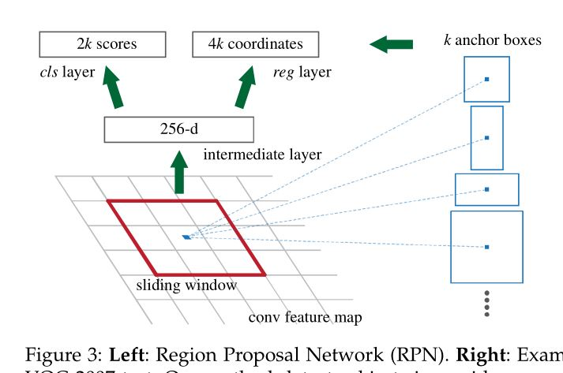

# 学习论文[Fatser R-CNN:Towards Real-Time Object Detection with Region Proposal Networks](https://arxiv.org/abs/1506.01497)

## 1 摘要&介绍

- Fast R-CNN仍然存在耗时的问题——区域建议的计算selective search
- 提出Region Proposal Network（RPN），取代selective search，检测网络共享全图的卷积特征 -> 使得区域建议生成基本无成本
  - RPN是全卷积网络，预测每个位置的目标的边界和分数
  - RPN通过端到端的训练，生成高质量的区域建议
- 通过共享卷积特征，将RPN和Fast R-CNN整合成一个简单的网络
  - 使用“attention”机制

## 2 相关工作

### (1) 目标建议

​	广泛使用的目标建议方法：

- 基于超像素分组的方法，如
  - **selective search**
  - CPMC
  - MCG
- 基于滑动窗口的方法，如
  - objectness in windows
  - EdgeBoxes

### (2) 目标检测的深度网络

- R-CNN对CNN进行端到端的训练，将建议的区域分类（目标类别/背景）
- R-CNN主要起到分类器的作用，但并不预测目标的边界

## 3 Faster R-CNN

​	Faster R-CNN有两个模块组成：

- 生成区域建议的深度全卷积网络RPN
- Fast R-CNN检测器

### (1) Region Proposal Network（RPN）

- RPN输入任意大小的图像，输出一组矩形的区域建议（含有目标分数）
- 在最后一个共享卷积层输出的特征图上，滑动一个小网络来生成区域建议
  - 每个滑动窗口映射出低维的特征
  - 输出的特征属兔到两个滑动全连接网络：包围盒回归（reg）和包围盒分类（cls）

#### ① anchors

- 在每一个滑动窗口的位置，同时预测多个区域建议，每个位置上最大可能的区域建议数量记为k（k个包围盒），则
  - reg包围盒回归产生4k个编码的**坐标**
  - cls包围盒分类产生2k个分数（预测 是/不是 目标）
- 这k个区域建议视为k个参考框的参数化，称作**anchors**
- anchor位于滑动窗口的中间（如上图右）
- 对每一个W\*H的特征图，一共有W\*H\*k个anchor，一般k=9

##### (a) 变换不变性anchor

- 保证在任何位置生成相同的区域建议
- 会缩小模型的大小

##### (b) 多尺度anchor

​	提出了一个解决多尺度问题的新机制：使用多尺度的参考框（如下图c）

- 在**anchor金字塔**上建立的，更有成本效益
- 用不同尺度/不同纵横比的anchor框，来对包围盒进行分类和回归
- 只依赖于图像和特征图的单一尺度，使用单一尺度的过滤器
- 使用Fast R-CNN检测器中实现的，在单尺度图像上计算卷积特征
- 多尺度anchor是实现共享特征，不需要额外成本来解决多尺度问题

#### ② 损失函数

​	为了训练RPN，给每个anchor附加一个二元标签，既不是正也不是负的anchor对训练没有影响

- **正标签**：当anchor和真值框有最高的IoU，或这个**IoU超过0.7**

  - 一个真值框可能给多个anchor附加正标签

- **负标签**：当anchor对所有的真值框的IoU都小于0.3

- **损失函数**：
  $$
  L(\{p_i\},\{t_i\})=\frac{1}{N_{cls}}\sum_iL_{cls}(p_i,p_i^*)+\lambda\frac{1}{N_{reg}}\sum_ip_i^*L_{reg}(t_i,t_i^*)\\
  其中，i：即批次中的第i个anchor，p_i：即第i个anchor是一个目标的概率，\\
  p_i^*：即真值标签，若anchor为是正的，则为1，是负的，则为0，\\
  t_i：是一个向量，用来表示预测的包围盒的四个参数化的坐标，\\
  t_i^*：表示和正的anchor相关的真值框。\\
  L_{cls}：表示分类的损失，L_{reg}：表示回归的损失
  $$

  - 分类损失：使用log函数

  - 回归损失：
    $$
    L_{reg}(t_i,t_i^*)=R(t_i-t_i^*)\\
    其中，R为robust\ loss，只有当p_i^*=1时才激活
    $$

  - N_cls取256，批次的大小；N_reg取anchor的个数，WxH；λ取10.

- **包围盒回归**，对包围盒的中心坐标和长宽的四个值进行参数化：

  - 计算预测的框和anchor框的偏移

  $$
  t_x=(x-x_a)/w_a,\\
  t_y=(y-y_a)/h_a,\\
  t_w=log(w/w_a),\\
  t_h=log(h/h_a),
  $$

  - 计算真值框和anchor框的偏移

  $$
  t_x^*=(x*-x_a)/w_a,\\
  t_y^*=(y^*-y_a)/h_a,\\
  t_w^*=log(w^*/w_a),\\
  t_h^*=log(h^*/h_a),
  $$

#### ③ 训练RPN

​	RPN可以通过向后传播和SGD随机梯度下降，来进行端到端的训练

- 对每个批次中的每个图像，随机抽取图像中的256个anchor来计算损失函数，其中正和负的比例为1：1
- 从标准偏差为0.01的零均值高斯分布中抽取权重来随机初始化所有的新网络层，其他的层（如共享的卷积层）通过预训练ImageNet的分类模型来初始化
- 调整ZF网络的所有层和VGG网络conv3_1以上的卷积层

### (2) RPN和Fast R-CNN共享特征

#### ① 交替训练

1. 先训练RPN
2. 使用生成的区域建议来训练Fast R-CNN
3. 用Fast R-CNN调整过的网络，反过来用来初始化RPN（这就是交替）

#### ② 近似联合训练

- RPN和Fast R-CNN在训练时归并为一个网络来进行训练

- 在每一个SGD随机梯度下降迭代中，前向传播产生区域建议，后向传播时信息同时来自于RPN损失和Fast R-CNN损失
  - 这个方法忽略了框坐标的导数，是一个近似的方法

#### ③ 非近似联合训练

​	对近似联合训练法进行改进，用“RoI warping”取代RoI pooling

#### ④ 四步交替训练（本文采用）

1. 训练**RPN**，用ImageNet预训练模型来初始化网络
2. 使用第一步的RPN生成的区域建议来训练一个独立的**检测网络**（**与第一步的网络不共享卷积层**），也是用ImageNet预训练模型进行初始化
3. 使用检测网络来初始化RPN的训练，固定**共享**的卷积层，只微调RPN特有的一些网络层
4. 保持固定共享的卷积层，微调Fast R-CNN特有的一些网络层

### (3) 实现细节

- 训练和预测都采用单尺度图像，将图像缩放到短边为600像素 -> 因为使用多尺度图像速度慢
- 当anchor超出图像的范围，在训练时要忽略这类anchor，否则无法收敛
- RPN生成的区域建议使用NMS非极大值抑制法来去重，IoU阈值为0.7

