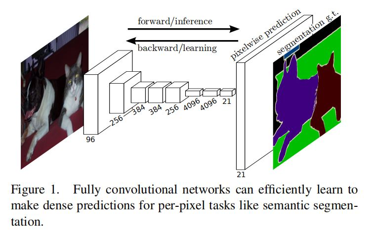
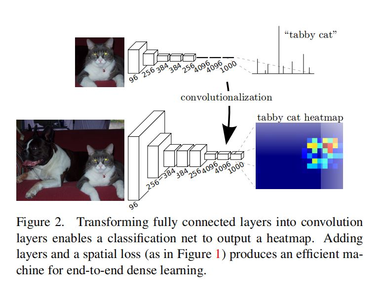
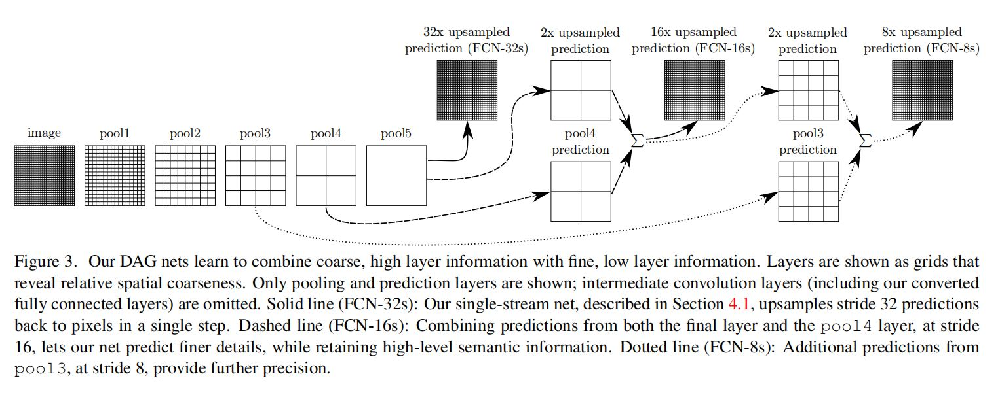
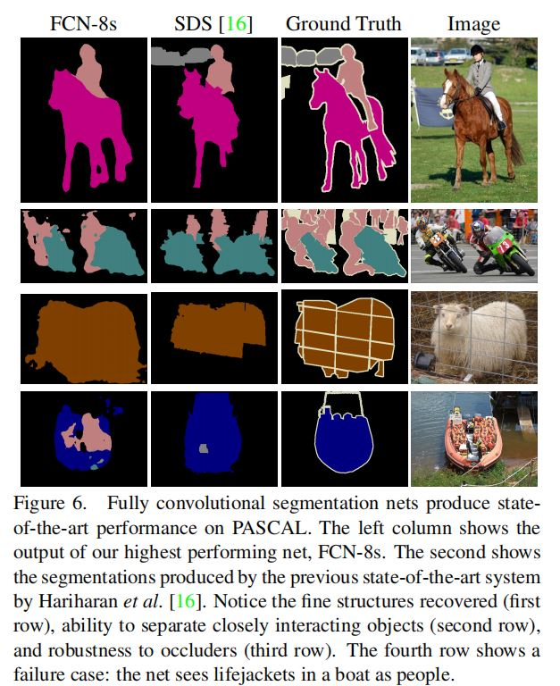

# 学习论文 [Fully Convolutional Networks for Semantic Segmentation 基于全卷积网络的语义分割](https://arxiv.org/abs/1411.4038 "Title")

## 摘要

### 1 卷积网络

- 是强大的视觉模型
- 可以产生多层次的特征

### 2 全卷积网络FCN

#### (1) 重点

- 端到端，像素到像素地训练
  - 在语义分割领域上超越了最先进的技术
- 接受任意大小的输入，经过推理和学习，产生相应大小的输出



#### (2) 内容

- 定义并描述**全卷积网络**，将分类转移到**密集预测（像素到像素）**
- 将现有的**分类网络**调整为**FCN**
  - 现有分类模型
    - AlexNet
    - VGG net
    - GoogLeNet
  - 采用数据集
    - PASCAL VOC
    - NYUDv2
    - SIFT Flow
- 通过**微调（fine-tuning）**将学习到的参数转移到分割任务上（迁移学习？）
- **定义一个新颖的“跳跃”结构**
  - 解决局部信息随着网络加深而丢失的问题（将浅层信息备份）
  - 将来自深的、粗糙（图像小，物体的空间信息比较丰富）的层的语义信息 和 来自浅的、细致（图像大，物体的几何信息比较丰富）的层的表征信息结合


##  介绍

### 1 卷积网络

#### (1) 已经实现的语义分割

​	每个像素都被标记为属于 包含它的目标或区域 的类别

#### (2) 从粗糙到细致的预测的改进

​	对每个像素进行预测

### 2 端到端、像素到像素的全卷积网络FCN

- 有监督的预训练（supervised pre-training）
  - 在已有的分类网络基础上调整参数继续训练
- 像素预测（pixelwise prediction）


## 相关工作

### 1 深度分类网络

- AlexNet
- VGG net
- GoogLeNet

### 2 迁移学习

- 视觉识别
- 检测
- 实例分割和语义分割

### 3 FCNs历史

#### (1) 具有全卷积推理和学习的检测

- Matan首次将卷积网络LeNet扩展为任意大小的输入（数字串的识别）
- Wolf&Platt将卷积网络扩展为2维图像的输出

#### (2) 具有全卷积推理

- Ning粗糙的多类别分割
- Sermanet滑动窗口检测
- Pinheiro&Collobert语义分割
- Eigen图像恢复

#### (3) 具有全卷积训练

- Tompson姿势估计

### 4 使用卷积网络进行密集预测

#### (1) 历史工作

- Ning语义分割
- Ciresan边界预测
- Eigen图像恢复和深度估计

#### (2) 历史例子的特点

- 限制容量和接受野
- patchwise拼凑式训练
- 输入移位-输出交错等

### 5 在深度分类架构上扩展

#### (1) 类似的历史方法——不是端到端学习

- 在一个混合模型中，采用了深度分类网络来做语义分割
- 用采样边界盒/区域来微调一个R-CNN

#### (2) 本文——端到端

- 使用图像分类作为**有监督的预训练**
- 通过 微调全卷积 简单高效地学习输入的**整个图像**


## FCNs

### 1 使用分类器（图像级别）进行密集预测（像素级别）

#### (1) 经典识别网络（全连接层）特点

​	全连接层 要求**固定大小的输入**，且产生非空间**（一维）的输出**

#### (2) FCN：全连接层 -> 卷积层

- 可以输入任意大小的图像并产生相应大小的输出
- 产生问题：
  - 输出的维度会因为二次采样不断降低，图像越来越小
  - 需要将图像进行不断放大到原图像的大小

### 2 粗糙的输出->精确的密集预测

#### (1) 移动和缝合shift-and-stitch（没有采用）

- 不插值
- 输入移位+输出交错

#### (2) 网络内向上采样upsampling（即反卷积deconvolution）

- 插值
  - 简单的双线性插值仅依赖于输入和输出神经元的相对位置
- 反卷积操作简单
  - 只要将卷积的向前和向后传递做反向处理
- 向上采样应用在网络内端到端的学习（从像素到像素的损失开始反向传播）
- 反卷积的过滤器不需要固定，可以通过学习得到

### 3 patchwise拼凑式（小块）训练 vs 整个图像的全卷积训练


#### (1)（采样）patchwise训练（没有采用）

- 可以减少图像的冗余信息
- 常用来解决图像的空间相关性
- 对过多的图像需要花费更多时间收敛

#### (2)（整个图像）全卷积训练（采用）

- 对loss加权 -> 解决类不平衡性
- 对loss采样 -> 解决输入图像的空间相关性


## 分割架构

### 1 从分类器到密集FCN

- 丢弃每个网络的分类器层
- 将全连接层替换为卷积层



### 2 改进预测输出的精度

#### (1) 层融合——建立连接将最后的预测层与较低层，以合适的步长结合



- 对较浅层（比如pool4，1/16）添加1x1的卷积层 -> 产生类别预测（1/16）
- 对较深层（比如conv7，1/32）添加2x的向上采样层 -> 产生类别预测（1/16）
- 将两个类别预测（1/16）相加（融合）后，向上采样/反卷积（步长16）-> 产生跟原图像一样大小的预测图（FCN-16s）
- 实验表示，继续到FCN-8s（与pool3融合）会使结果有所改进，但不需要继续与更浅层（pool2、pool1）融合，改进不大

#### (2) 其他方法

- 减小池化层的步长 
  - 需要增大卷积核
- shift-and-stitch 
  - 改进不如层融合

### 3 实验框架

#### (1) 优化

​	SGD随机梯度下降

#### (2) fine-tuning微调

​	通过整个网络的反向传播对所有层进行微调

#### (3) patch sampling小块采样（不必要）

​	对过多的图像需要花费更多时间收敛

#### (4) 类别平衡（不必要）

- 类别不平衡——有3/4的部分是背景
- 全卷积训练也可以通过**对loss进行加权和采样**来平衡

#### (5) 密集预测（像素到像素）——通过向上采样upsampling

- 最后一层的反卷积过滤器固定为 双线性插值
- 中间的向上采样层，初始化为双线性向上采样，之后学习得到

#### (6) 在每个方向预测为32像素（没明显改进）

#### (7) 使用更多的训练数据（有改进）


## 结果

​	他们实验证明，使用**PASCAL数据集**训练效果最好，FCN特点：

- 可以恢复精细的结构（第一行）
- 可以分离紧密相交的物体（第二行）
- 受遮挡物的影响小（第三行）




# 学习源码

## 训练

- 实验时使用Pascal VOC数据集（VOC2012）
- 实验时使用VGG16预训练模型，整体结构如下图


- FCN32s，FCN16s和FCN8s模型的具体结构 如随后的三张图（ppt作图）所示

  - _FCNHead()实际上有两个卷积层

    ```python
    class _FCNHead(nn.Module):
        def __init__(self, in_channels, channels, norm_layer=nn.BatchNorm2d, **kwargs):
            super(_FCNHead, self).__init__()
            inter_channels = in_channels // 4
            self.block = nn.Sequential(
                nn.Conv2d(in_channels, inter_channels, 3, padding=1, bias=False),
                norm_layer(inter_channels),
                nn.ReLU(inplace=True),
                nn.Dropout(0.1),
                nn.Conv2d(inter_channels, channels, 1)
            )
    
        def forward(self, x):
            return self.block(x)
    ```

  - score_pool3()和score_pool4()分别是卷积

    ```python
    self.score_pool3 = nn.Conv2d(256, nclass, 1)
    self.score_pool4 = nn.Conv2d(512, nclass, 1)
    ```

  - 向上采样/反卷积采用的是双线性插值

    ```python
    upscore2 = F.interpolate(score_fr, score_pool4.size()[2:], mode='bilinear', align_corners=True)
    fuse_pool4 = upscore2 + score_pool4
    
    upscore_pool4 = F.interpolate(fuse_pool4, score_pool3.size()[2:], mode='bilinear',align_corners=True)
    fuse_pool3 = upscore_pool4 + score_pool3
    ```

  - FCN32s

    

  - FCN16s

    

  - FCN8s

    

- 使用交叉熵损失函数 + SGD随机梯度下降优化

## 测试

- 实验时使用Pascal VOC数据集（VOC2012)
- 测试结果如下
  - 分别截了测试集中的前五个（下图一），中间五个（下图二）和后五个（下图三）的预测效果
  - 六列分别是原图，训练了50个epochs的FCN32s，训练了200个epochs的FCN16s，训练了200个epochs的FCN8s和理想的语义分割效果图
    - 论文中有说到训练达到175个epochs才会有比较好的效果
    - 预测图中，有一些分割彻底失败的结果，比如下图三的第三行
    - 也有一些比较成功的例子，比如下图一的第五行和下图二的第二行（都是人骑自行车。。）
    - 从下面三个图可以看出，与网络中越浅层做融合的分割效果越好，越细致，因为浅层的局部特征信息更丰富
    - 要想更接近理想效果，应该还要增大epochs和在接近收敛时降低学习率


